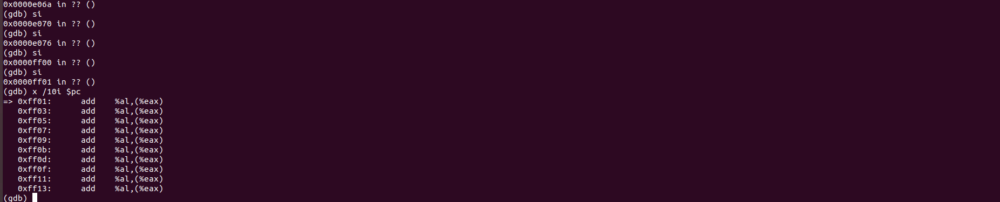
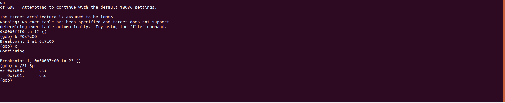
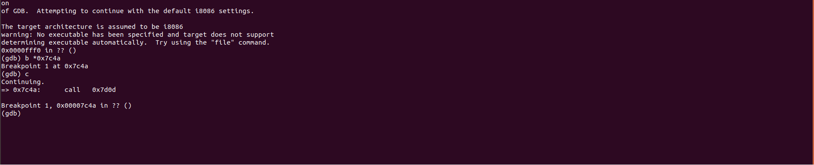
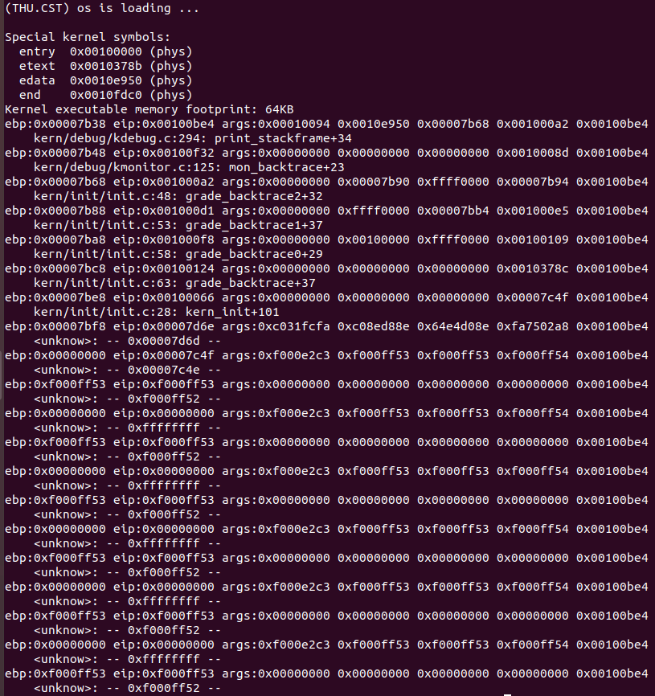

操作系统 lab1 实验报告

计64 李文浩 2016011316

## 练习1 分析ucore.img的生成过程

ucore.img的生成过程为，先生成bootblock，再生成kernel，再将两者结合成最终的ucore.img，下面我根据makefile文件进行进一步的说明：

### 1.初始化部分

- 初始化一些常量：

  ```makefile
  PROJ	:= challenge
  EMPTY	:=
  SPACE	:= $(EMPTY) $(EMPTY)
  SLASH	:= /
  
  V       := @
  ```

- 定义编译器相关选项以及QEMU相关选项

  前半部分决定gcc及qemu的前缀，后半部分根据是否用LLVM决定是用gcc还是clang进行编译

  ```makefile
  ifndef GCCPREFIX
  GCCPREFIX := $(shell if i386-elf-objdump -i 2>&1 | grep '^elf32-i386$$' >/dev/null 2>&1; \
  	then echo 'i386-elf-'; \
  	elif objdump -i 2>&1 | grep 'elf32-i386' >/dev/null 2>&1; \
  	then echo ''; \
  	else echo "***" 1>&2; \
  	echo "*** Error: Couldn't find an i386-elf version of GCC/binutils." 1>&2; \
  	echo "*** Is the directory with i386-elf-gcc in your PATH?" 1>&2; \
  	echo "*** If your i386-elf toolchain is installed with a command" 1>&2; \
  	echo "*** prefix other than 'i386-elf-', set your GCCPREFIX" 1>&2; \
  	echo "*** environment variable to that prefix and run 'make' again." 1>&2; \
  	echo "*** To turn off this error, run 'gmake GCCPREFIX= ...'." 1>&2; \
  	echo "***" 1>&2; exit 1; fi)
  endif
  
  # try to infer the correct QEMU
  ifndef QEMU
  QEMU := $(shell if which qemu-system-i386 > /dev/null; \
  	then echo 'qemu-system-i386'; exit; \
  	elif which i386-elf-qemu > /dev/null; \
  	then echo 'i386-elf-qemu'; exit; \
  	elif which qemu > /dev/null; \
  	then echo 'qemu'; exit; \
  	else \
  	echo "***" 1>&2; \
  	echo "*** Error: Couldn't find a working QEMU executable." 1>&2; \
  	echo "*** Is the directory containing the qemu binary in your PATH" 1>&2; \
  	echo "***" 1>&2; exit 1; fi)
  endif
  
  # eliminate default suffix rules
  .SUFFIXES: .c .S .h
  
  # delete target files if there is an error (or make is interrupted)
  .DELETE_ON_ERROR:
  
  # define compiler and flags
  ifndef  USELLVM
  HOSTCC		:= gcc
  HOSTCFLAGS	:= -g -Wall -O2
  CC		:= $(GCCPREFIX)gcc
  CFLAGS	:= -fno-builtin -Wall -ggdb -m32 -gstabs -nostdinc $(DEFS)
  CFLAGS	+= $(shell $(CC) -fno-stack-protector -E -x c /dev/null >/dev/null 2>&1 && echo -fno-stack-protector)
  else
  HOSTCC		:= clang
  HOSTCFLAGS	:= -g -Wall -O2
  CC		:= clang
  CFLAGS	:= -fno-builtin -Wall -g -m32 -mno-sse -nostdinc $(DEFS)
  CFLAGS	+= $(shell $(CC) -fno-stack-protector -E -x c /dev/null >/dev/null 2>&1 && echo -fno-stack-protector)
  endif
  ```

- 定义一些常用指令，包括链接，objcopy/dump以及拷贝，移动，删除等一系列系统指令

  ```makefile
  CTYPE	:= c S
  
  LD      := $(GCCPREFIX)ld
  LDFLAGS	:= -m $(shell $(LD) -V | grep elf_i386 2>/dev/null)
  LDFLAGS	+= -nostdlib
  
  OBJCOPY := $(GCCPREFIX)objcopy
  OBJDUMP := $(GCCPREFIX)objdump
  
  COPY	:= cp
  MKDIR   := mkdir -p
  MV		:= mv
  RM		:= rm -f
  AWK		:= awk
  SED		:= sed
  SH		:= sh
  TR		:= tr
  TOUCH	:= touch -c
  
  OBJDIR	:= obj
  BINDIR	:= bin
  
  ALLOBJS	:=
  ALLDEPS	:=
  TARGETS	:=
  ```

- 包含所需函数，以及声明一些用到的地址，寻找匹配需要用到的文件

  ```makefile
  include tools/function.mk
  
  listf_cc = $(call listf,$(1),$(CTYPE))
  
  # for cc
  add_files_cc = $(call add_files,$(1),$(CC),$(CFLAGS) $(3),$(2),$(4))
  create_target_cc = $(call create_target,$(1),$(2),$(3),$(CC),$(CFLAGS))
  
  # for hostcc
  add_files_host = $(call add_files,$(1),$(HOSTCC),$(HOSTCFLAGS),$(2),$(3))
  create_target_host = $(call create_target,$(1),$(2),$(3),$(HOSTCC),$(HOSTCFLAGS))
  
  cgtype = $(patsubst %.$(2),%.$(3),$(1))
  objfile = $(call toobj,$(1))
  asmfile = $(call cgtype,$(call toobj,$(1)),o,asm)
  outfile = $(call cgtype,$(call toobj,$(1)),o,out)
  symfile = $(call cgtype,$(call toobj,$(1)),o,sym)
  
  # for match pattern
  match = $(shell echo $(2) | $(AWK) '{for(i=1;i<=NF;i++){if(match("$(1)","^"$$(i)"$$")){exit 1;}}}'; echo $$?)
  
  # >>>>>>>>>>>>>>>>>>>>>>>>>>>>>>>>>>>>>>>>>>>>>>>>>>>>>>>>>>>>>>>>>>>
  # include kernel/user
  
  INCLUDE	+= libs/
  
  CFLAGS	+= $(addprefix -I,$(INCLUDE))
  
  LIBDIR	+= libs
  
  $(call add_files_cc,$(call listf_cc,$(LIBDIR)),libs,)
  ```

### 2.进行kernel部分的编译和链接

- 先进行kernel需要部分的编译，代码如下：

  ```makefile
  # -------------------------------------------------------------------
  # kernel
  
  KINCLUDE	+= kern/debug/ \
  			   kern/driver/ \
  			   kern/trap/ \
  			   kern/mm/
  
  KSRCDIR		+= kern/init \
  			   kern/libs \
  			   kern/debug \
  			   kern/driver \
  			   kern/trap \
  			   kern/mm
  
  KCFLAGS		+= $(addprefix -I,$(KINCLUDE))
  
  $(call add_files_cc,$(call listf_cc,$(KSRCDIR)),kernel,$(KCFLAGS))
  
  KOBJS	= $(call read_packet,kernel libs)
  
  ```

  主要即列出编译的文件所在的目录，然后调用之前定义的宏，使用gcc或clang进行编译。

  对应在shell执行的指令如下：

  ```shell
  + cc kern/init/init.c
  gcc -Ikern/init/ -fno-builtin -Wall -ggdb -m32 -gstabs -nostdinc  -fno-stack-protector -Ilibs/ -Ikern/debug/ -Ikern/driver/ -Ikern/trap/ -Ikern/mm/ -c kern/init/init.c -o obj/kern/init/init.o
  kern/init/init.c:95:1: warning: ‘lab1_switch_test’ defined but not used [-Wunused-function]
   lab1_switch_test(void) {
   ^~~~~~~~~~~~~~~~
  + cc kern/libs/stdio.c
  gcc -Ikern/libs/ -fno-builtin -Wall -ggdb -m32 -gstabs -nostdinc  -fno-stack-protector -Ilibs/ -Ikern/debug/ -Ikern/driver/ -Ikern/trap/ -Ikern/mm/ -c kern/libs/stdio.c -o obj/kern/libs/stdio.o
  + cc kern/libs/readline.c
  gcc -Ikern/libs/ -fno-builtin -Wall -ggdb -m32 -gstabs -nostdinc  -fno-stack-protector -Ilibs/ -Ikern/debug/ -Ikern/driver/ -Ikern/trap/ -Ikern/mm/ -c kern/libs/readline.c -o obj/kern/libs/readline.o
  + cc kern/debug/panic.c
  gcc -Ikern/debug/ -fno-builtin -Wall -ggdb -m32 -gstabs -nostdinc  -fno-stack-protector -Ilibs/ -Ikern/debug/ -Ikern/driver/ -Ikern/trap/ -Ikern/mm/ -c kern/debug/panic.c -o obj/kern/debug/panic.o
  kern/debug/panic.c: In function ‘__panic’:
  kern/debug/panic.c:27:5: warning: implicit declaration of function ‘print_stackframe’; did you mean ‘print_trapframe’? [-Wimplicit-function-declaration]
       print_stackframe();
       ^~~~~~~~~~~~~~~~
       print_trapframe
  + cc kern/debug/kdebug.c
  gcc -Ikern/debug/ -fno-builtin -Wall -ggdb -m32 -gstabs -nostdinc  -fno-stack-protector -Ilibs/ -Ikern/debug/ -Ikern/driver/ -Ikern/trap/ -Ikern/mm/ -c kern/debug/kdebug.c -o obj/kern/debug/kdebug.o
  kern/debug/kdebug.c:251:1: warning: ‘read_eip’ defined but not used [-Wunused-function]
   read_eip(void) {
   ^~~~~~~~
  + cc kern/debug/kmonitor.c
  gcc -Ikern/debug/ -fno-builtin -Wall -ggdb -m32 -gstabs -nostdinc  -fno-stack-protector -Ilibs/ -Ikern/debug/ -Ikern/driver/ -Ikern/trap/ -Ikern/mm/ -c kern/debug/kmonitor.c -o obj/kern/debug/kmonitor.o
  + cc kern/driver/clock.c
  gcc -Ikern/driver/ -fno-builtin -Wall -ggdb -m32 -gstabs -nostdinc  -fno-stack-protector -Ilibs/ -Ikern/debug/ -Ikern/driver/ -Ikern/trap/ -Ikern/mm/ -c kern/driver/clock.c -o obj/kern/driver/clock.o
  + cc kern/driver/console.c
  gcc -Ikern/driver/ -fno-builtin -Wall -ggdb -m32 -gstabs -nostdinc  -fno-stack-protector -Ilibs/ -Ikern/debug/ -Ikern/driver/ -Ikern/trap/ -Ikern/mm/ -c kern/driver/console.c -o obj/kern/driver/console.o
  + cc kern/driver/picirq.c
  gcc -Ikern/driver/ -fno-builtin -Wall -ggdb -m32 -gstabs -nostdinc  -fno-stack-protector -Ilibs/ -Ikern/debug/ -Ikern/driver/ -Ikern/trap/ -Ikern/mm/ -c kern/driver/picirq.c -o obj/kern/driver/picirq.o
  + cc kern/driver/intr.c
  gcc -Ikern/driver/ -fno-builtin -Wall -ggdb -m32 -gstabs -nostdinc  -fno-stack-protector -Ilibs/ -Ikern/debug/ -Ikern/driver/ -Ikern/trap/ -Ikern/mm/ -c kern/driver/intr.c -o obj/kern/driver/intr.o
  + cc kern/trap/trap.c
  gcc -Ikern/trap/ -fno-builtin -Wall -ggdb -m32 -gstabs -nostdinc  -fno-stack-protector -Ilibs/ -Ikern/debug/ -Ikern/driver/ -Ikern/trap/ -Ikern/mm/ -c kern/trap/trap.c -o obj/kern/trap/trap.o
  kern/trap/trap.c:30:26: warning: ‘idt_pd’ defined but not used [-Wunused-variable]
   static struct pseudodesc idt_pd = {
                            ^~~~~~
  kern/trap/trap.c:14:13: warning: ‘print_ticks’ defined but not used [-Wunused-function]
   static void print_ticks() {
               ^~~~~~~~~~~
  + cc kern/trap/vectors.S
  gcc -Ikern/trap/ -fno-builtin -Wall -ggdb -m32 -gstabs -nostdinc  -fno-stack-protector -Ilibs/ -Ikern/debug/ -Ikern/driver/ -Ikern/trap/ -Ikern/mm/ -c kern/trap/vectors.S -o obj/kern/trap/vectors.o
  + cc kern/trap/trapentry.S
  gcc -Ikern/trap/ -fno-builtin -Wall -ggdb -m32 -gstabs -nostdinc  -fno-stack-protector -Ilibs/ -Ikern/debug/ -Ikern/driver/ -Ikern/trap/ -Ikern/mm/ -c kern/trap/trapentry.S -o obj/kern/trap/trapentry.o
  + cc kern/mm/pmm.c
  gcc -Ikern/mm/ -fno-builtin -Wall -ggdb -m32 -gstabs -nostdinc  -fno-stack-protector -Ilibs/ -Ikern/debug/ -Ikern/driver/ -Ikern/trap/ -Ikern/mm/ -c kern/mm/pmm.c -o obj/kern/mm/pmm.o
  + cc libs/string.c
  gcc -Ilibs/ -fno-builtin -Wall -ggdb -m32 -gstabs -nostdinc  -fno-stack-protector -Ilibs/  -c libs/string.c -o obj/libs/string.o
  + cc libs/printfmt.c
  gcc -Ilibs/ -fno-builtin -Wall -ggdb -m32 -gstabs -nostdinc  -fno-stack-protector -Ilibs/  -c libs/printfmt.c -o obj/libs/printfmt.o
  ```

  可以看出，基本就是对每个文件编译生成.o文件的过程

- 下一步是将所有这些.o进行链接，得到最终的kernel文件，再进行objdump，对应的makefile代码如下：

  ```makefile
  kernel = $(call totarget,kernel)
  
  $(kernel): tools/kernel.ld
  
  $(kernel): $(KOBJS)
  	@echo + ld $@
  	$(V)$(LD) $(LDFLAGS) -T tools/kernel.ld -o $@ $(KOBJS)
  	@$(OBJDUMP) -S $@ > $(call asmfile,kernel)
  	@$(OBJDUMP) -t $@ | $(SED) '1,/SYMBOL TABLE/d; s/ .* / /; /^$$/d' > $(call symfile,kernel)
  
  $(call create_target,kernel)
  ```

  对应在shell中执行的代码如下：

  ```shell
  + ld bin/kernel
  ld -m    elf_i386 -nostdlib -T tools/kernel.ld -o bin/kernel  obj/kern/init/init.o obj/kern/libs/stdio.o obj/kern/libs/readline.o obj/kern/debug/panic.o obj/kern/debug/kdebug.o obj/kern/debug/kmonitor.o obj/kern/driver/clock.o obj/kern/driver/console.o obj/kern/driver/picirq.o obj/kern/driver/intr.o obj/kern/trap/trap.o obj/kern/trap/vectors.o obj/kern/trap/trapentry.o obj/kern/mm/pmm.o  obj/libs/string.o obj/libs/printfmt.o
  ```

### 3.进行bootblock部分的编译和链接

- 编译过程基本相同，就是对各个文件分别进行编译，但是区别在于有一个部分是.S汇编文件，故而这个汇编就行不用编译

  对应的makefile代码如下：

  ```makefile
  # create bootblock
  bootfiles = $(call listf_cc,boot)
  $(foreach f,$(bootfiles),$(call cc_compile,$(f),$(CC),$(CFLAGS) -Os -nostdinc))
  
  # create 'sign' tools
  $(call add_files_host,tools/sign.c,sign,sign)
  $(call create_target_host,sign,sign)
  ```

  在shell中对应的执行的命令如下：

  ```shell
  + cc boot/bootasm.S
  gcc -Iboot/ -fno-builtin -Wall -ggdb -m32 -gstabs -nostdinc  -fno-stack-protector -Ilibs/ -Os -nostdinc -c boot/bootasm.S -o obj/boot/bootasm.o
  + cc boot/bootmain.c
  gcc -Iboot/ -fno-builtin -Wall -ggdb -m32 -gstabs -nostdinc  -fno-stack-protector -Ilibs/ -Os -nostdinc -c boot/bootmain.c -o obj/boot/bootmain.o
  + cc tools/sign.c
  gcc -Itools/ -g -Wall -O2 -c tools/sign.c -o obj/sign/tools/sign.o
  gcc -g -Wall -O2 obj/sign/tools/sign.o -o bin/sign
  ```

- 下一步就是对结果进行链接，然后objdump，比上面多一步的是，还要objdump后copy出来，再用sign生成最后的结果，对应makefile代码如下：

  ```makefile
  bootblock = $(call totarget,bootblock)
  
  $(bootblock): $(call toobj,$(bootfiles)) | $(call totarget,sign)
  	@echo + ld $@
  	$(V)$(LD) $(LDFLAGS) -N -e start -Ttext 0x7C00 $^ -o $(call toobj,bootblock)
  	@$(OBJDUMP) -S $(call objfile,bootblock) > $(call asmfile,bootblock)
  	@$(OBJCOPY) -S -O binary $(call objfile,bootblock) $(call outfile,bootblock)
  	@$(call totarget,sign) $(call outfile,bootblock) $(bootblock)
  
  $(call create_target,bootblock)
  ```

  而在shell中对应的命令如下：

  ```shell
  + ld bin/bootblock
  ld -m    elf_i386 -nostdlib -N -e start -Ttext 0x7C00 obj/boot/bootasm.o obj/boot/bootmain.o -o obj/bootblock.o
  'obj/bootblock.out' size: 488 bytes
  build 512 bytes boot sector: 'bin/bootblock' success!
  ```

### 4.将两者结合生成img

- 先生成一个有10000块大小的文件，每个块512字节，用0填充

- 再将bootblock填充进其第一个块

- 再将kernel填充进后面的块

  具体makefile代码如下：

  ```makefile
  UCOREIMG	:= $(call totarget,ucore.img)
  
  $(UCOREIMG): $(kernel) $(bootblock)
  	$(V)dd if=/dev/zero of=$@ count=10000
  	$(V)dd if=$(bootblock) of=$@ conv=notrunc
  	$(V)dd if=$(kernel) of=$@ seek=1 conv=notrunc
  
  $(call create_target,ucore.img)
  ```

  shell输出的信息如下：

  ```shell
  dd if=/dev/zero of=bin/ucore.img count=10000
  记录了10000+0 的读入
  记录了10000+0 的写出
  5120000 bytes (5.1 MB, 4.9 MiB) copied, 1.18624 s, 4.3 MB/s
  dd if=bin/bootblock of=bin/ucore.img conv=notrunc
  记录了1+0 的读入
  记录了1+0 的写出
  512 bytes copied, 0.00688002 s, 74.4 kB/s
  dd if=bin/kernel of=bin/ucore.img seek=1 conv=notrunc
  记录了147+1 的读入
  记录了147+1 的写出
  75744 bytes (76 kB, 74 KiB) copied, 0.0957189 s, 791 kB/s
  ```

### 5.补充：一个被系统认为是符合规范的硬盘主引导扇区的特征是什么？

在`sign.c`中有如下代码段：

```c
	char buf[512];
	……
	buf[510] = 0x55;
    buf[511] = 0xAA;
    FILE *ofp = fopen(argv[2], "wb+");
    size = fwrite(buf, 1, 512, ofp);
    if (size != 512) {
        fprintf(stderr, "write '%s' error, size is %d.\n", argv[2], size);
        return -1;
    }
    fclose(ofp);
```

说明一个被系统认为是符合规范的硬盘主引导扇区有如下特征：

- 长度为512字节
- 用0填充不足512字节的区域
- 倒数后两位分别为`0x55`与`0xAA`

## 练习2 使用qemu执行并调试lab1中的软件

### 1.单步跟踪BIOS的执行

将`lab1/tools/gdbinit`中的内容改为

```
set architecture i8086
target remote :1234
```

然后在 lab1目录下，执行

```
make debug
```

进入gdb界面，并不断进行si单步执行，还可通过x /\*i $pc（\*为数）显示pc后的几条指令，效果如下：



### 2.在0x7c00设置断点



如上图所示，用b指令在0x7c00设置断点，然后用c连续执行，直到断点停止，断点设置正确。

### 3.跟踪代码执行并进行反汇编

先在`lab1/tools/gdbinit`中添加如下内容：

```
define hook-stop
x/i $pc
end
```

然后继续在gdb中用si执行，得到如下内容：

```assembly
(gdb) c
Continuing.
=> 0x7c00:      cli

Breakpoint 1, 0x00007c00 in ?? ()
(gdb) si
=> 0x7c01:      cld
0x00007c01 in ?? ()
(gdb) si
=> 0x7c02:      xor    %eax,%eax
0x00007c02 in ?? ()
(gdb) si
=> 0x7c04:      mov    %eax,%ds
0x00007c04 in ?? ()
(gdb) si
=> 0x7c06:      mov    %eax,%es
0x00007c06 in ?? ()
(gdb) si
=> 0x7c08:      mov    %eax,%ss
0x00007c08 in ?? ()
(gdb) si
=> 0x7c0a:      in     $0x64,%al
0x00007c0a in ?? ()
(gdb) si
=> 0x7c0c:      test   $0x2,%al
0x00007c0c in ?? ()
(gdb) si
=> 0x7c0e:      jne    0x7c0a
0x00007c0e in ?? ()
(gdb) si
=> 0x7c10:      mov    $0xd1,%al
0x00007c10 in ?? ()
(gdb) si
=> 0x7c12:      out    %al,$0x64
0x00007c12 in ?? ()
(gdb) si
=> 0x7c14:      in     $0x64,%al
0x00007c14 in ?? ()
(gdb) si
=> 0x7c16:      test   $0x2,%al
0x00007c16 in ?? ()
(gdb) si
=> 0x7c18:      jne    0x7c14
0x00007c18 in ?? ()
(gdb) si
=> 0x7c1a:      mov    $0xdf,%al
0x00007c1a in ?? ()
(gdb) si
=> 0x7c1c:      out    %al,$0x60
0x00007c1c in ?? ()
(gdb) si
=> 0x7c1e:      lgdtl  (%esi)
0x00007c1e in ?? ()
(gdb) si
=> 0x7c23:      mov    %cr0,%eax
0x00007c23 in ?? ()
(gdb) si
=> 0x7c26:      or     $0x1,%ax
0x00007c26 in ?? ()
(gdb) si
=> 0x7c2a:      mov    %eax,%cr0
0x00007c2a in ?? ()
(gdb) si
=> 0x7c2d:      ljmp   $0xb866,$0x87c32
0x00007c2d in ?? ()
(gdb) si
=> 0x7c32:      mov    $0x10,%ax
0x00007c32 in ?? ()
(gdb) si
=> 0x7c36:      mov    %eax,%ds
0x00007c36 in ?? ()
0x00007c36 in ?? ()
(gdb) si
=> 0x7c38:      mov    %eax,%es
0x00007c38 in ?? ()
(gdb) si
=> 0x7c3a:      mov    %eax,%fs
0x00007c3a in ?? ()
(gdb) si
=> 0x7c3c:      mov    %eax,%gs
0x00007c3c in ?? ()
(gdb) si
=> 0x7c3e:      mov    %eax,%ss
0x00007c3e in ?? ()
(gdb) si
=> 0x7c40:      mov    $0x0,%ebp
0x00007c40 in ?? ()
(gdb) si
=> 0x7c45:      mov    $0x7c00,%esp
0x00007c45 in ?? ()
(gdb) si
=> 0x7c4a:      call   0x7d0d
0x00007c4a in ?? ()
```

而`bootasm.S`对应内容如下：

```assembly
.globl start
start:
.code16                                             # Assemble for 16-bit mode
    cli                                             # Disable interrupts
    cld                                             # String operations increment

    # Set up the important data segment registers (DS, ES, SS).
    xorw %ax, %ax                                   # Segment number zero
    movw %ax, %ds                                   # -> Data Segment
    movw %ax, %es                                   # -> Extra Segment
    movw %ax, %ss                                   # -> Stack Segment

    # Enable A20:
    #  For backwards compatibility with the earliest PCs, physical
    #  address line 20 is tied low, so that addresses higher than
    #  1MB wrap around to zero by default. This code undoes this.
seta20.1:
    inb $0x64, %al                                  # Wait for not busy(8042 input buffer empty).
    testb $0x2, %al
    jnz seta20.1

    movb $0xd1, %al                                 # 0xd1 -> port 0x64
    outb %al, $0x64                                 # 0xd1 means: write data to 8042's P2 port

seta20.2:
    inb $0x64, %al                                  # Wait for not busy(8042 input buffer empty).
    testb $0x2, %al
    jnz seta20.2

    movb $0xdf, %al                                 # 0xdf -> port 0x60
    outb %al, $0x60                                 # 0xdf = 11011111, means set P2's A20 bit(the 1 bit) to 1

    # Switch from real to protected mode, using a bootstrap GDT
    # and segment translation that makes virtual addresses
    # identical to physical addresses, so that the
    # effective memory map does not change during the switch.
    lgdt gdtdesc
    movl %cr0, %eax
    orl $CR0_PE_ON, %eax
    movl %eax, %cr0

    # Jump to next instruction, but in 32-bit code segment.
    # Switches processor into 32-bit mode.
    ljmp $PROT_MODE_CSEG, $protcseg

.code32                                             # Assemble for 32-bit mode
protcseg:
    # Set up the protected-mode data segment registers
    movw $PROT_MODE_DSEG, %ax                       # Our data segment selector
    movw %ax, %ds                                   # -> DS: Data Segment
    movw %ax, %es                                   # -> ES: Extra Segment
    movw %ax, %fs                                   # -> FS
    movw %ax, %gs                                   # -> GS
    movw %ax, %ss                                   # -> SS: Stack Segment

    # Set up the stack pointer and call into C. The stack region is from 0--start(0x7c00)
    movl $0x0, %ebp
    movl $start, %esp
    call bootmain
```

反汇编得到的`bootblock.asm`具体内容如下：

```assembly
00007c00 <start>:

# start address should be 0:7c00, in real mode, the beginning address of the running bootloader
.globl start
start:
.code16                                             # Assemble for 16-bit mode
    cli                                             # Disable interrupts
    7c00:	fa                   	cli    
    cld                                             # String operations increment
    7c01:	fc                   	cld    

    # Set up the important data segment registers (DS, ES, SS).
    xorw %ax, %ax                                   # Segment number zero
    7c02:	31 c0                	xor    %eax,%eax
    movw %ax, %ds                                   # -> Data Segment
    7c04:	8e d8                	mov    %eax,%ds
    movw %ax, %es                                   # -> Extra Segment
    7c06:	8e c0                	mov    %eax,%es
    movw %ax, %ss                                   # -> Stack Segment
    7c08:	8e d0                	mov    %eax,%ss

00007c0a <seta20.1>:
    # Enable A20:
    #  For backwards compatibility with the earliest PCs, physical
    #  address line 20 is tied low, so that addresses higher than
    #  1MB wrap around to zero by default. This code undoes this.
seta20.1:
    inb $0x64, %al                                  # Wait for not busy(8042 input buffer empty).
    7c0a:	e4 64                	in     $0x64,%al
    testb $0x2, %al
    7c0c:	a8 02                	test   $0x2,%al
    jnz seta20.1
    7c0e:	75 fa                	jne    7c0a <seta20.1>

    movb $0xd1, %al                                 # 0xd1 -> port 0x64
    7c10:	b0 d1                	mov    $0xd1,%al
    outb %al, $0x64                                 # 0xd1 means: write data to 8042's P2 port
    7c12:	e6 64                	out    %al,$0x64

00007c14 <seta20.2>:

seta20.2:
    inb $0x64, %al                                  # Wait for not busy(8042 input buffer empty).
    7c14:	e4 64                	in     $0x64,%al
    testb $0x2, %al
    7c16:	a8 02                	test   $0x2,%al
    jnz seta20.2
    7c18:	75 fa                	jne    7c14 <seta20.2>

    movb $0xdf, %al                                 # 0xdf -> port 0x60
    7c1a:	b0 df                	mov    $0xdf,%al
    outb %al, $0x60                                 # 0xdf = 11011111, means set P2's A20 bit(the 1 bit) to 1
    7c1c:	e6 60                	out    %al,$0x60

    # Switch from real to protected mode, using a bootstrap GDT
    # and segment translation that makes virtual addresses
    # identical to physical addresses, so that the
    # effective memory map does not change during the switch.
    lgdt gdtdesc
    7c1e:	0f 01 16             	lgdtl  (%esi)
    7c21:	6c                   	insb   (%dx),%es:(%edi)
    7c22:	7c 0f                	jl     7c33 <protcseg+0x1>
    movl %cr0, %eax
    7c24:	20 c0                	and    %al,%al
    orl $CR0_PE_ON, %eax
    7c26:	66 83 c8 01          	or     $0x1,%ax
    movl %eax, %cr0
    7c2a:	0f 22 c0             	mov    %eax,%cr0

    # Jump to next instruction, but in 32-bit code segment.
    # Switches processor into 32-bit mode.
    ljmp $PROT_MODE_CSEG, $protcseg
    7c2d:	ea                   	.byte 0xea
    7c2e:	32 7c 08 00          	xor    0x0(%eax,%ecx,1),%bh

00007c32 <protcseg>:

.code32                                             # Assemble for 32-bit mode
protcseg:
    # Set up the protected-mode data segment registers
    movw $PROT_MODE_DSEG, %ax                       # Our data segment selector
    7c32:	66 b8 10 00          	mov    $0x10,%ax
    movw %ax, %ds                                   # -> DS: Data Segment
    7c36:	8e d8                	mov    %eax,%ds
    movw %ax, %es                                   # -> ES: Extra Segment
    7c38:	8e c0                	mov    %eax,%es
    movw %ax, %fs                                   # -> FS
    7c3a:	8e e0                	mov    %eax,%fs
    movw %ax, %gs                                   # -> GS
    7c3c:	8e e8                	mov    %eax,%gs
    movw %ax, %ss                                   # -> SS: Stack Segment
    7c3e:	8e d0                	mov    %eax,%ss

    # Set up the stack pointer and call into C. The stack region is from 0--start(0x7c00)
    movl $0x0, %ebp
    7c40:	bd 00 00 00 00       	mov    $0x0,%ebp
    movl $start, %esp
    7c45:	bc 00 7c 00 00       	mov    $0x7c00,%esp
    call bootmain
    7c4a:	e8 be 00 00 00       	call   7d0d <bootmain>
```

代码全都相同，只是反汇编的内容将某些指令拆分了（比如`lgdt`），然后将某些变量代表的地址填上了具体地址，这也是汇编的必然过程。

### 4.设置其他位置断点

选择在进入bootmain函数时设置断点，按照gdb输出结果，该函数在0x7c4a，于是按照2中相似方法，设置断点成功，效果图如下：



## 练习3 分析bootloader进入保护模式的过程

bootloader进入保护模式主要分为以下几步：

### 1.关中断并将段寄存器清零

```assembly
.code16                                             # Assemble for 16-bit mode
    cli                                             # Disable interrupts
    cld                                             # String operations increment

    # Set up the important data segment registers (DS, ES, SS).
    xorw %ax, %ax                                   # Segment number zero
    movw %ax, %ds                                   # -> Data Segment
    movw %ax, %es                                   # -> Extra Segment
    movw %ax, %ss                                   # -> Stack Segment
```

用`cli`关掉中断，然后利用`cld`将`df`清零

然后下面四条语句是通过先将`%ax`清零再挪给三个段寄存器的方式将三个段寄存器清零。

这部分是bootloader必要的初始化，关掉中断也是防止bootloading过程被中断打扰

### 2. 开启A20

```assembly
seta20.1:
    inb $0x64, %al                                  # Wait for not busy(8042 input buffer empty).
    testb $0x2, %al
    jnz seta20.1

    movb $0xd1, %al                                 # 0xd1 -> port 0x64
    outb %al, $0x64                                 # 0xd1 means: write data to 8042's P2 port

seta20.2:
    inb $0x64, %al                                  # Wait for not busy(8042 input buffer empty).
    testb $0x2, %al
    jnz seta20.2

    movb $0xdf, %al                                 # 0xdf -> port 0x60
    outb %al, $0x60                                 # 0xdf = 11011111, means set P2's A20 bit(the 1 bit) to 1
```

为了使能所有地址位的寻址能力，需要打开A20地址线控制。

开启的过程为：

- 等到8042端口的input buffer不忙
- 将写8042端口的命令写到8042 input buffer
- 等到8042端口的input buffer不忙
- 把P2的第二位置成1的命令写到8042 input buffer

### 3.加载GDT表并进入保护模式

```asm
    # Switch from real to protected mode, using a bootstrap GDT
    # and segment translation that makes virtual addresses
    # identical to physical addresses, so that the
    # effective memory map does not change during the switch.
    lgdt gdtdesc
    movl %cr0, %eax
    orl $CR0_PE_ON, %eax
    movl %eax, %cr0
```

利用`lgdt`语句加载gdt表，然后用以下三条语句将`%cr0`的最低位置1以进入保护模式。

GDT表的具体内容如下：

```assembly
# Bootstrap GDT
.p2align 2                                          # force 4 byte alignment
gdt
    SEG_NULLASM                                     # null seg
    SEG_ASM(STA_X|STA_R, 0x0, 0xffffffff)           # code seg for bootloader and kernel
    SEG_ASM(STA_W, 0x0, 0xffffffff)                 # data seg for bootloader and kernel

gdtdesc:
    .word 0x17                                      # sizeof(gdt) - 1
    .long gdt                                       # address gdt
```

可见，主要包含一个大小，然后就是三个段，分别是空段，代码段和数据段

### 4.进入32位模式

```assembly
    # Jump to next instruction, but in 32-bit code segment.
    # Switches processor into 32-bit mode.
    ljmp $PROT_MODE_CSEG, $protcseg

.code32                                             # Assemble for 32-bit mode
protcseg:
```

利用长跳转跳到32位模式

### 5.初始化32位段寄存器

```
    # Set up the protected-mode data segment registers
    movw $PROT_MODE_DSEG, %ax                       # Our data segment selector
    movw %ax, %ds                                   # -> DS: Data Segment
    movw %ax, %es                                   # -> ES: Extra Segment
    movw %ax, %fs                                   # -> FS
    movw %ax, %gs                                   # -> GS
    movw %ax, %ss                                   # -> SS: Stack Segment
```

将32位各段寄存器以与16位的同样方法置0。

### 6.初始化堆栈指针寄存器并跳到主bootloader过程

```assembly
    # Set up the stack pointer and call into C. The stack region is from 0--start(0x7c00)
    movl $0x0, %ebp
    movl $start, %esp
    call bootmain
```

设置`ebp`与`esp`两个与栈相关的指针，并调用`bootmain`主函数。

### 7.以防万一的死循环

```assembly
    # If bootmain returns (it shouldn't), loop.
spin:
    jmp spin

```

`bootmain`函数按理不应返回，但以防万一，设置一个死循环。

## 练习4：分析bootloader加载ELF格式的OS的过程

### 1.bootloader读取磁盘扇区的过程

此部分代码在`bootmain.c`中的`readsect`函数中，具体过程如下：

- 先等待硬盘至其不忙，即可读数据，此部分主要通过读取`0x1f7`地址的数据完成，包装在`waitdisk`函数中，具体代码如下：

  ```c
  static void
  waitdisk(void) {
      while ((inb(0x1F7) & 0xC0) != 0x40)
          /* do nothing */;
  }
  ```

- 向硬盘发出读扇区的指令，通过将数据放到`0x1F2-0x1F7`地址段完成，具体代码及对应解释如下：

  ```c
      outb(0x1F2, 1);
  	//表示读1个扇区
      outb(0x1F3, secno & 0xFF);
  	//取要读的扇区第0-7位
      outb(0x1F4, (secno >> 8) & 0xFF);
  	//取要读的扇区第8-15位
      outb(0x1F5, (secno >> 16) & 0xFF);
  	//取要读的扇区第16-23位
      outb(0x1F6, ((secno >> 24) & 0xF) | 0xE0);
  	//取要读的扇区第24-27位，第4位置1表示从盘
      outb(0x1F7, 0x20);   
  	//读扇区命令：0x20
  ```

- 等待磁盘准备好数据，继续调用`waitdisk`函数

- 将磁盘输出的数据读入到某个内存中，代码如下：

  ```c
  insl(0x1F0, dst, SECTSIZE / 4);
  ```

### 2. bootloader加载elf格式OS的过程

- 先读取elf的头部（8个扇区），然后判断其是否是一个合法的elf头（通过判断其`e_magic`对应的几位是否为特定值完成），若不合法，则直接输出非法信息，对应的代码如下：

  ```c
  	// read the 1st page off disk
      readseg((uintptr_t)ELFHDR, SECTSIZE * 8, 0);
  
      // is this a valid ELF?
      if (ELFHDR->e_magic != ELF_MAGIC) {
          goto bad;
      }
  	……
  bad:
      outw(0x8A00, 0x8A00);
      outw(0x8A00, 0x8E00);
  
      /* do nothing */
      while (1);
  ```

- 然后从elf头中读取出描述加载到内存位置的描述表，根据此表将elf对应的磁盘段读取到内存中，对应代码如下：

  ```c
      ph = (struct proghdr *)((uintptr_t)ELFHDR + ELFHDR->e_phoff);
      eph = ph + ELFHDR->e_phnum;
      for (; ph < eph; ph ++) {
          readseg(ph->p_va & 0xFFFFFF, ph->p_memsz, ph->p_offset);
      }
  ```

- 最后根据elf头中的相关信息找到内核的入口并进入，对应代码如下：

  ```c
      ((void (*)(void))(ELFHDR->e_entry & 0xFFFFFF))();
  ```

## 练习5： 实现函数调用堆栈跟踪函数

该函数我的实现如下：

```c
    uint32_t ebp = read_ebp();
    uint32_t eip = read_eip();
    int i;
    for(i = 0; i < STACKFRAME_DEPTH; i++)
    {
        uint32_t *call_argu = (uint32_t *) ebp + 2;
        cprintf("ebp:0x%08x eip:0x%08x args:0x%08x 0x%08x 0x%08x 0x%08x 0x%08x\n", ebp, eip, call_argu[0], call_argu[1], call_argu[2], call_argu[3]);
        print_debuginfo(eip - 1);
        eip = *((uint32_t *) ebp + 1);
        ebp = *((uint32_t *) ebp);
    }
```

即先调用函数得到`%ebp`和`%eip`的值，然后在for循环中得到函数传递的参数并输出，再调用`print_debuginfo`函数，然后更新新的`%ebp`和`%eip`，执行结果如下：



大体与所给相同。

在实验要求描述的“最后一行”应该是第一个使用堆栈的函数，即bootloader初始化堆栈后调用的`bootmain`函数。bootloader设置的堆栈从0x7c00开始，故第一个ebp的地址为0x7bf8。

